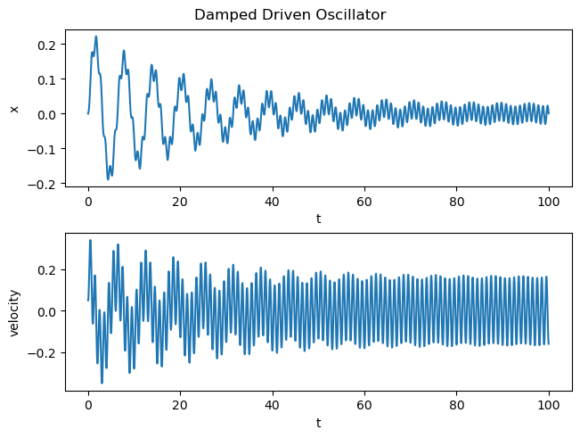

# Dynamical Systems and Neural Networks

## Introduction

Systems in nature, finance, and engineering evolve over time in interesting ways. Such systems are called **dynamical systems**. They can also be quite complex and  unpredictable, though in some cases they can be approximated to some sum of predictable patterns. 

Neural networks are able to pick up both simple and complex phenomena while using reasonably generalized training methods, provided they are tuned with some level of expertise.

In this project I build a simulation library for generating signals from dynamical systems, and then predict them using LSTM (Long short term memory) neural networks.

## Dynamical Systems: How do things change?

I'm going to go into a bit more detail on systems changing over time, using some math. If this is confusing, feel free to skip to the section on my applications of neural networks.

Let's say a system has *N* number of variables $x_1, x_2, ...x_N$.

We can consider this a dynamical system if the variables' time derivatives depend on the variables in question:

$$\dot{x}_1 = f(x_1,x_2, ... x_N)\\
\dot{x}_2 = f(x_1,x_2, ... x_N)\\
...\dot{x}_N = f(x_1,x_2, ... x_N)\\$$

**My simulation engine can generate signals for any system that can be rewritten in the above form.**

**Let's look at an example**

Behold, the damped driven oscillator:

Consider an object with mass m attached to a spring with "spring constant" k. There is also a friction constant b which damps the oscillation of the spring. Finally, there is also a driving force $F(t)$ pushing and pulling on the spring.

Let's say someone pulls on the mass away from the spring's equilibrium and let's go, this would lead to a harmonic oscillation, in addition to the driving force.

You will find this situation often written in the following standard form:

$$m\ddot{x} + b\dot{x} + kx = F(t)$$

However, we need time derivatives as explicit functions. So we rewrite the above as:

$$\ddot{x} = \dfrac{1}{m}(F(t) - b\dot{x} - kx)$$

If we define the mass's position $x_1 \coloneqq x$ and the mass's velocity $x_2 \coloneqq \dot{x}$, then we essentially have the variables' time derivatives expressed as functions in the previously mentioned general form:

$$
\dot{x_1} = \dot{x_2}\\
\dot{x_2} = \dfrac{1}{m}(F(t) - bx_2 - kx_1)
$$

**How does my simulation engine put these equations into practice?**

We first inform the engine initial conditions at time $t=0$. This includes the mass's initial velocity $\dot{x}_{t=0}$ and initial position $x_{t=0}$. In addition to knowing the driving force at all times, this allows us to calculate the initial acceleration:

$\ddot{x}_{t=0} = \dfrac{1}{m}(F(t=0) - b\dot{x}_{t=0} - kx_{t=0})$

Then, given a discrete time step size $dt$, use $\ddot{x}_0$ to calculate the velocity at the next time step:

$$\dot{x}_{t=dt} = \ddot{x}_{t=0}dt$$

Repeat this over and over to generate a signal, iterating through values of $t=m\mathrm{d}t$:

$$\dot{x}_{t=(m+1)dt} = \ddot{x}_{t=mdt}$$

**What does the simulation end up looking like?**

Let's say I've got a driving force defined as a sine wave. Perhaps it's an elf meticulously pushing and pulling on the spring:

$$F(t) = \sin(2\pi t)$$

Furthermore I set the initial conditions and constant values as follows:

* mass $m = 1$
* friction constant $b = 0.1$
* spring constant $k = 0.1$
* initial position $x_{t=0} = 0$
* initial velocity $\dot{x}_{t=dt} = 0.5$

Plugging this into my engine we get the following signal:

## How to Use the Engine

Now that we've looked at an example, you may be wondering, **how do I use the engine to simulate my own nonlinear equation?**

First 