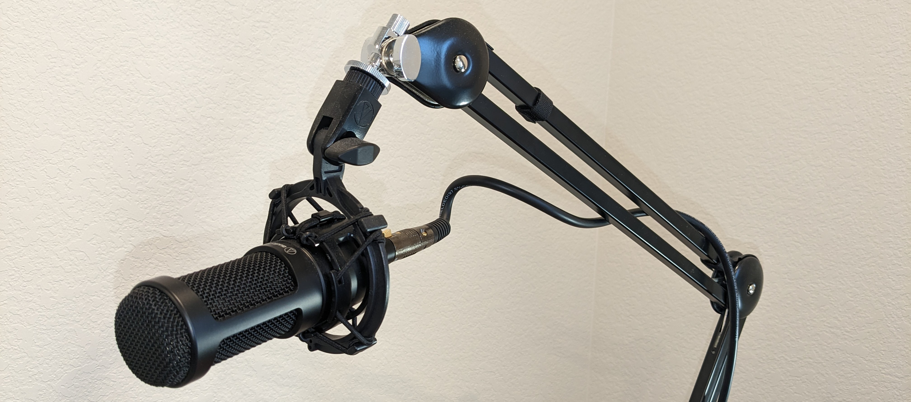
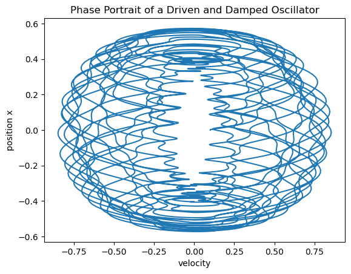
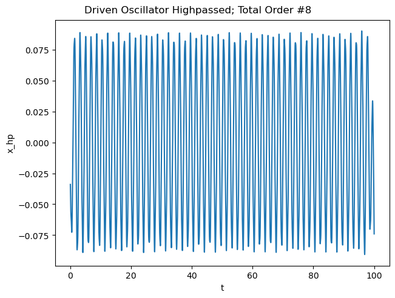
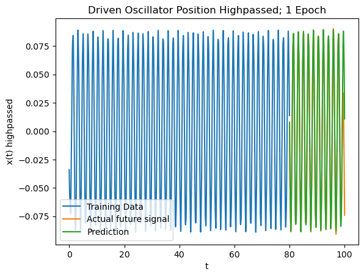
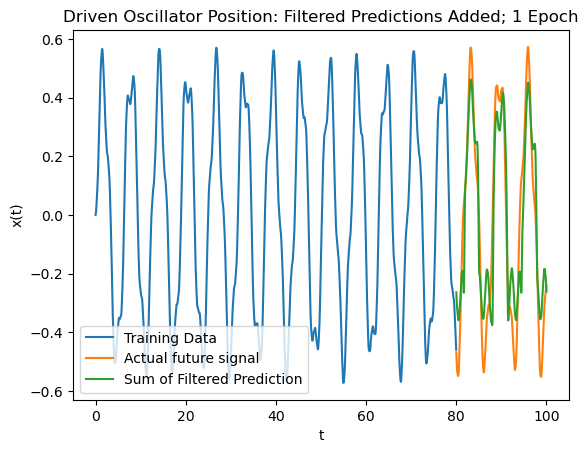
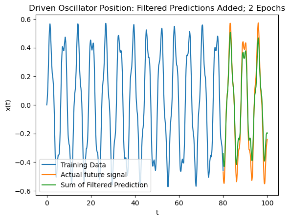
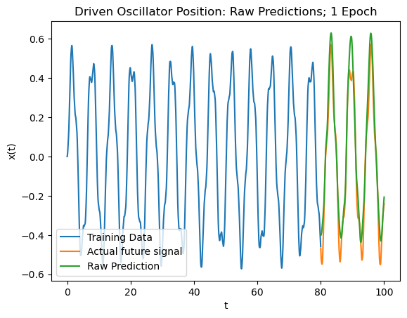
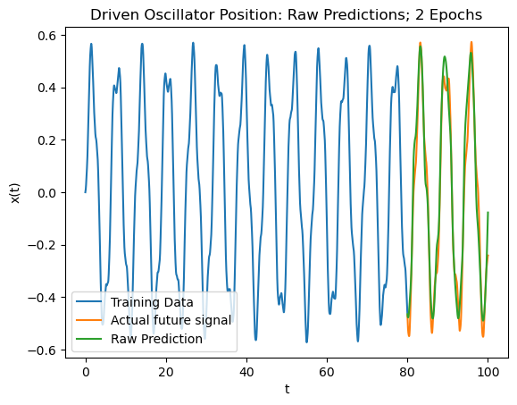
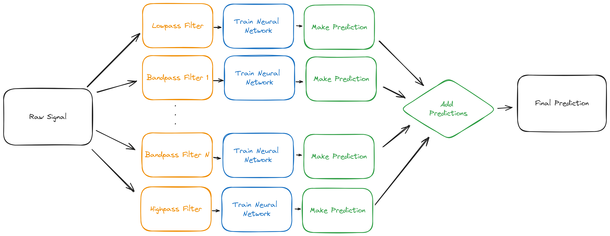

# Filters and Neural Networks

## Introduction

A song may be rich with all kinds of information. You might have vocals, bass, drums, guitar, not to mention the potential echoing of the room and all kinds of cool nonlinear effects like distortion.

Yet, audio engineers mix and master these signals, sometimes in surprisingly simple ways.

Let's say an audio engineer is limited to just the entire song recording and can't directly access individual instrument recordings. They are still able to separate the signal into mutiple frequency bands and edit the bands individually.

This 

sort of approach is common in atmospheric research as well. For example, different chemicals in the air (e.g. methane) can be differentiated by their different "spectral signatures". These signatures are obtainable from signals generated by pulse responses from laser sources.

So, how might we assist a neural network's prediction capability with these kinds of methods?

My idea is quite simple.

**In summary:**

I take a signal and split it into multiple signals using filters. I train a neural network for each filtered signal.

Then, I make a prediction from each neural network and add the predictions back together.

In this project I will be using a low pass filter and a high pass filter.

## Filters and Training

Let's try taking a signal and separating it into two different frequency bands.

I played around with the pararameters for my damped driven oscillator simulation until I was able to get two distinct bands of frequencies in my signal.

The damping effect is also negligible so we can simply call the signal a "driven oscillator". Ultimately, we start with a **raw signal**:

Just for fun, we can also examine the raw position plotted against velocity in a **phase portrait**:

Next, we set our **filters**.

I elect to split the signal into two signals: I apply a lowpass filter on the original signal to get a "lowpassed signal", and similar a highpass filter to get a "highpassed signal".

**Filtered Signals**

*The signal after being lowpass filtered forwards and backwards (to eliminate phase lag). The order # refers to the effective lowpass filter order, which is twice the original (since the filter is applied twice).*

*The signal after being highpass filtered forwards and backwards*

As you can see, we have separated the signal into distinct frequencies. The lowpassed signal has clear oscillations that are slower than the ones in the highpassed signal.

**Training Neural Networks**

See the repo for actual code.

Like my [dynamic modeler project](https://gaoadam.github.io/docs/projects/dynamic_modeler/dynamic_modeler.html), I use a windowing method to separate the data into neural network inputs and outputs (i.e. labels).

Each “input” window from “n” to “n + n_window” gets a subsequent “output” label from "n + n_window" to "n + n_window + n_predict".

I apply this process to each filtered signal and feed those filtered signals into the neural networks.

Furthermore I train the neural networks using a very small learning rate of $10^{-10}$ so that performance can be compared meaningfully.

## Neural Network Performance

Time to see how effective filtering can be!

First we look at the predictions from neural network for the  **lowpassed signal**

*Looks like the lowpass neural network is converging to an accurate prediction.*

Then we look at the predictions from neural network for the  **highpassed signal**

*Looks like the highpass neural network converges to an accurate prediction very quickly as well.*

Finally, let's look at the performance of the **filter based predictions added together**:

*The filtered predictions added together seem to converge to an accurate prediction.*

Let's compare this to a **baseline prediction**, which is made from a neural network I trained on the raw unfiltered signal itself.

*The raw prediction from the baseline neural network is decent, but seems to neglect high frequency phenomena.*

**Takeaway**:

A normal LSTM neural network may be limited in it's ability to capture higher frequency phenomena given a set number of layers. This may be solved through conventional methods like tuning the neural network parameters like depth.

However, a simpler solution may involve the use of filters.

## Thoughts and Next Steps

**Proper Performance Evaluation and Batch Processes**

My evaluation was qualitative in nature, to showcase the nature of filters in a simple project.

In the future, I may formalize this into a more "production-ready" process which tracks training performance over time.

Furthermore, you may notice that **I did not track training performance, i.e. loss per epoch.**

In my current process, each epoch is essentially treated as "one batch" of all the labeled windows in the signal. This means **a single epoch is extremely large, making loss per epoch rather meaningless when only one or two epochs is required**.

In the future, I may formalize a process to make each window a proper "batch", such that batches can be shuffled, and that loss per epoch becomes more meaningful.

**Many Filters**

Two filters is not always going to be sufficient in the real world. It would be interesting to see if the filtering process could be generalized to more complex situations.

What about a flexible framework that allows the user to split the signal with as many filters as they want? (For example, one may elect fora lowpass filter, a highpass filter, and $N$ number of bandpass filters.)

**Multivariate Neural Networks**

Finally, you may recall that in addition to the position, we also know the velocity of the oscillator. Given that there is a relationship between velocity and position, having a neural network train on both variable and predict both of them could lead to better performance.