# Filters, Signals, and Neural Networks
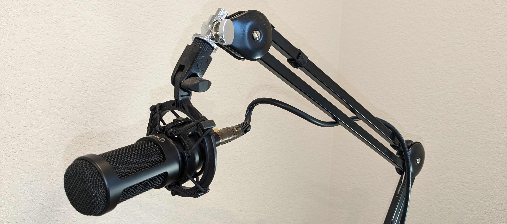

## Introduction

A song may be rich with all kinds of information. You might have vocals, bass, drums, guitar, not to mention the potential echoing of the room and all kinds of cool nonlinear effects like distortion.

Yet, audio engineers mix and master these signals, sometimes in shockingly simple ways.

Let's say an audio engineer is limited to just the entire song recording and can't directly access individual instrument recordings. They are still able to separate the signal into mutiple frequency bands and edit the bands individually.

This sort of approach is common in atmospheric research as well. For example, different chemicals in the air (e.g. methane) can be differentiated by their different "spectral signatures". These signatures are obtainable from signals generated by pulse responses from laser sources.

So, how might we assist a neural network's prediction capability with these kinds of methods?

My idea is quite simple.

**In summary:**

I take a signal and split it into multiple signals using filters. I train a neural network for each filtered signal.

Then, I make a prediction from each neural network and add the predictions back together.

In this project I will be using a low pass filter and a high pass filter.

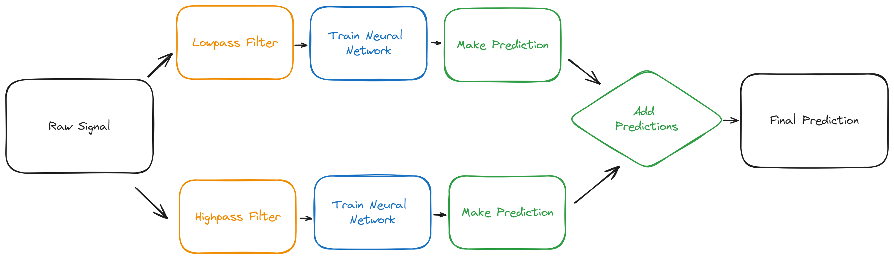

## Filters and Training

Let's try taking a signal and separating it into two different frequency bands.

I played around with the pararameters with my damped driven oscillator simulation until I was able to get two distinct bands of frequencies in my signal.

The damping effect is also negligible so we can simply call the signal a "driven oscillator". Ultimately, we start with a **raw signal**:

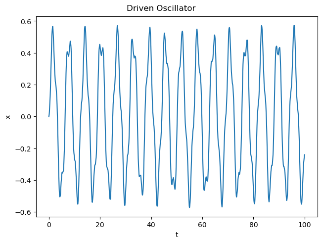

Next, we set our **filters**.

I elect to split the signal into two signals: I apply a lowpass filter on the original signal to get a "lowpassed signal", and similar a highpass filter to get a "highpassed signal".

**Filtered Signals**

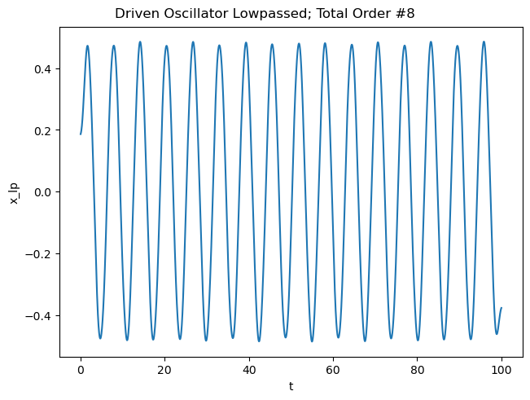
*The signal after being lowpass filtered forwards and backwards (to eliminate phase lag). The order # refers to the effective lowpass filter order, which is twice the original (since the filter is applied twice).*

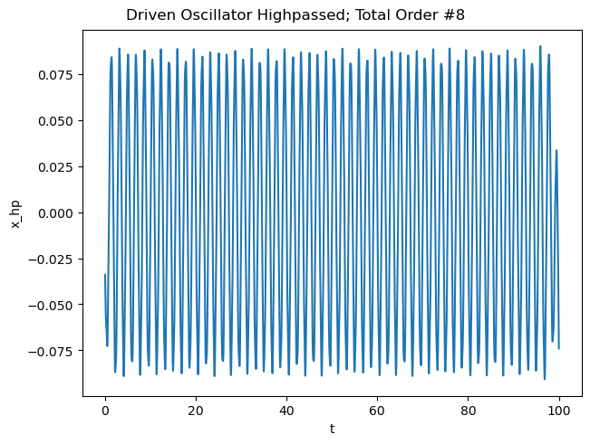
*The signal after being highpass filtered forwards and backwards*

As you can see, we have quite distinctly separated the signals' frequencies. The lowpassed signal has clear oscillations that are slower than the ones in the highpassed signal.

**Training Neural Networks**

See the repo for actual code.

Like my [dynamic modeler project](https://gaoadam.github.io/docs/projects/dynamic_modeler/dynamic_modeler.html), I use a sort of windowing method to separate the data into neural network inputs and outputs (i.e. labels).

Each “input” window from “n” to “n + n_window” gets a subsequent “output” label from "n + n_window" to "n + n_window + n_predict".

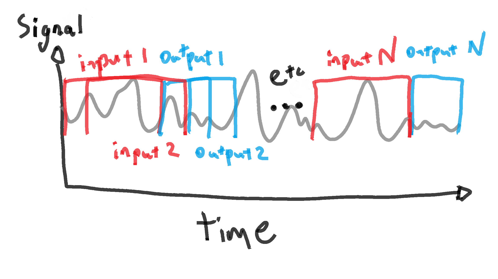

I apply this process to each filtered signal and feed those filtered signals into the neural networks.

## Neural Network Performance

Time to see how effective filtering can be!

First we look at the predictions from neural network for the  **lowpassed signal**

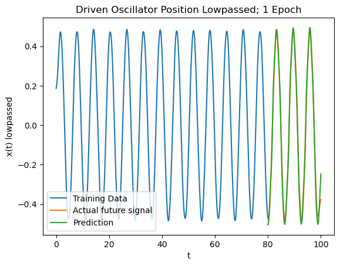
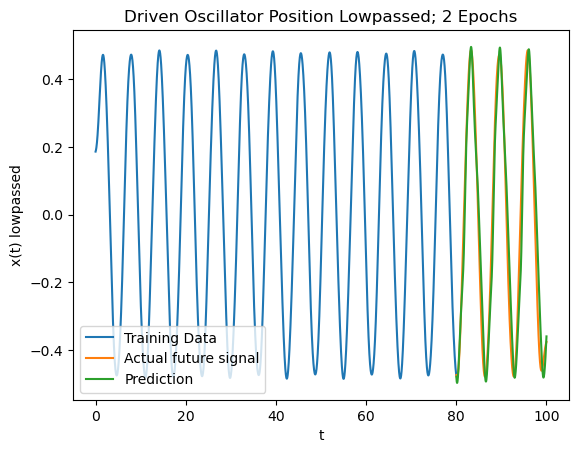

Then we look at the predictions from neural network for the  **highpassed signal**

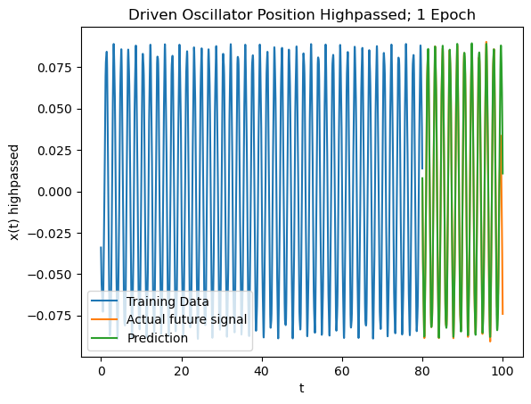
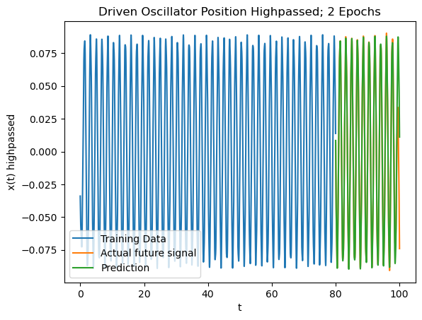

Finally, let's look at the performance of the **filter based predictions added together**:

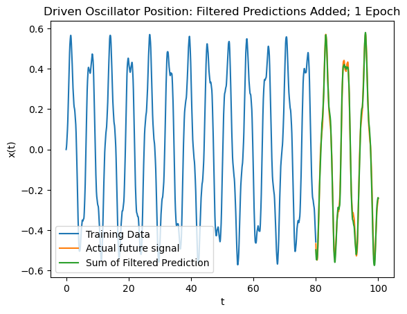
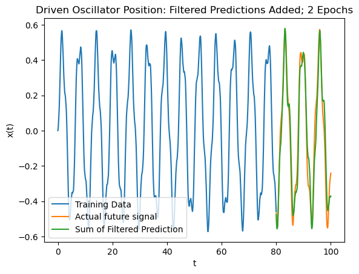

Let's compare this to a **baseline prediction**, which is made from a neural network I trained on the raw unfiltered signal itself.

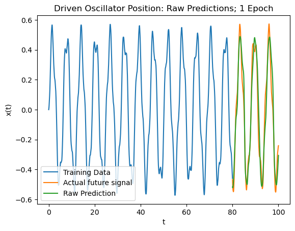
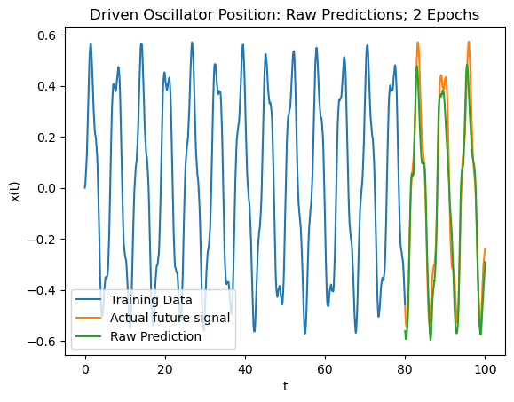

Since it's not super clear which process performed better, we can compare the mean squared error between the prediction and actual future signal, ie **MSE**:

MSE Raw 1 Epochs: 0.3650
MSE Raw 2 Epochs: 0.4110
MSE LP Filtered: 1 Epochs: 0.3530
MSE LP Filtered: 2 Epochs: 0.3296
MSE HP Filtered: 1 Epochs: 0.1232
MSE HP Filtered: 2 Epochs: 0.1230
MSE Filtered: 1 Epochs: 0.3473
MSE Filtered: 2 Epochs: 0.3265

## Next Steps
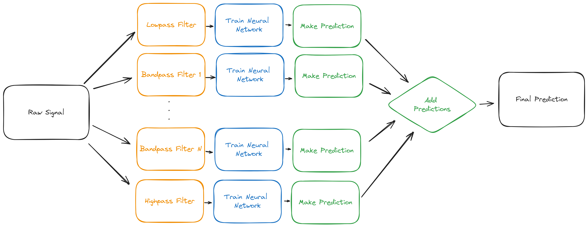