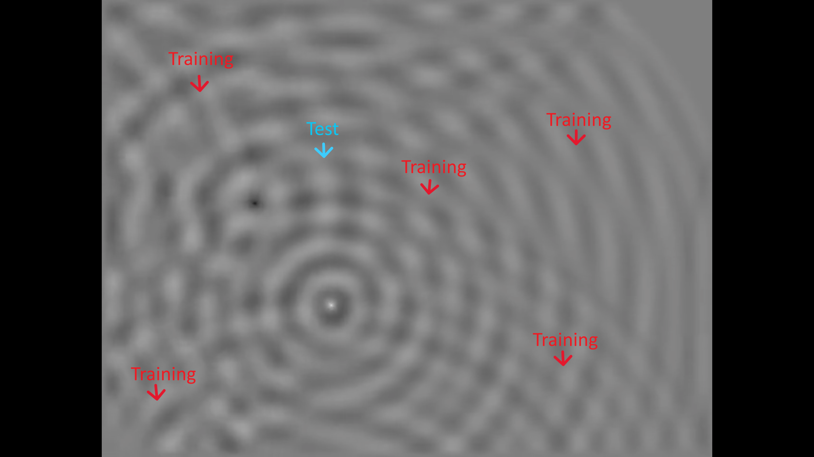
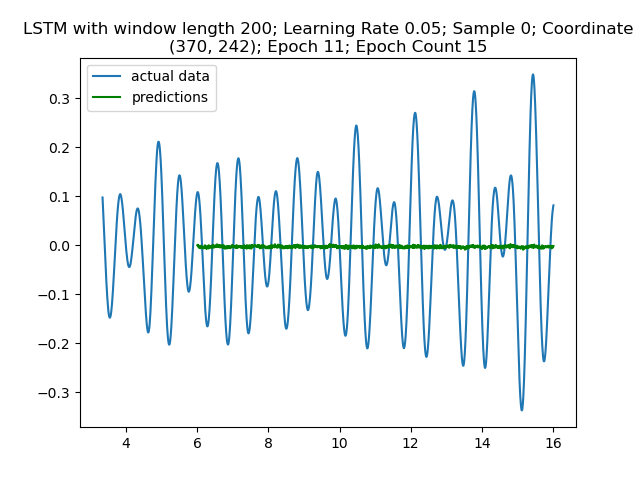
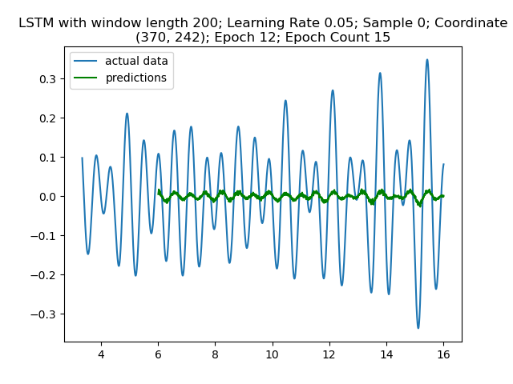
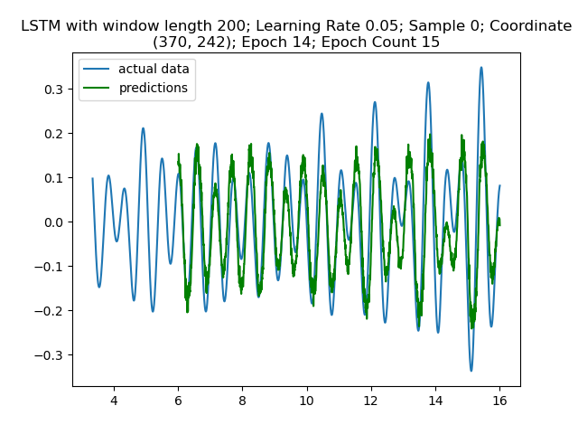
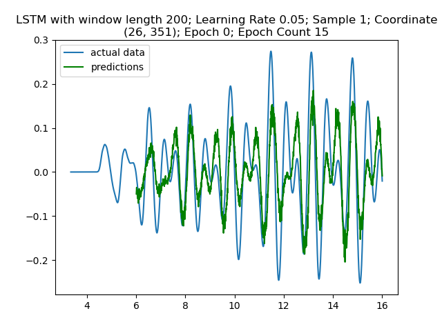
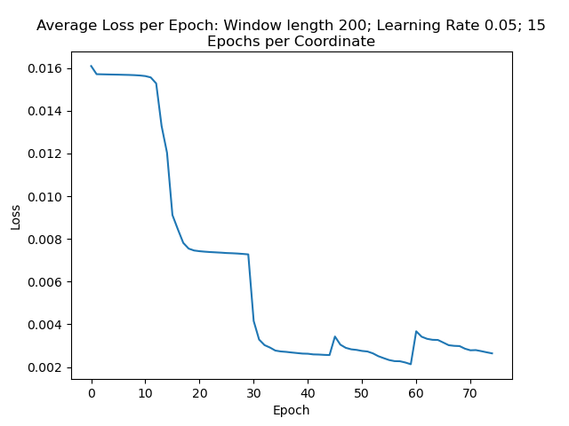
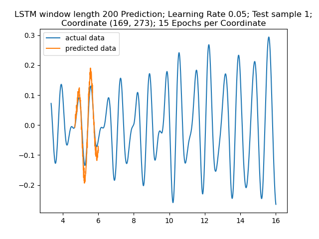
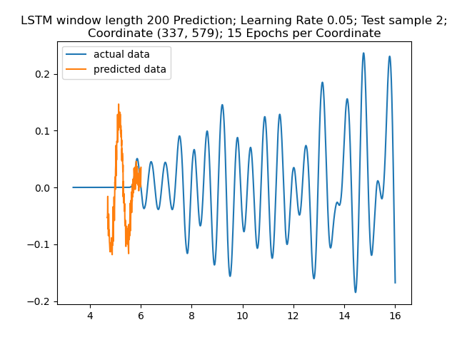

# Predicting a Wave Simulation using Neural Networks


*photo taken by me ... of weather*
*(Golden Gate Canyon State Park, CO)*

See [GitHub repo](https://github.com/gaoadam/wave-simulation) for source code of the neural network training and wave simulation process. This can be found in the "demo_lstm.ipynb" notebook file.

## Introduction

A weather forecasting model might use yesterday's temperature to predict tommorow's temperature.

But could it predict the temperature in New York City if it was trained solely on the daily temperature of Denver? What if it was trained on the temperature of 10 different cities spread across the world? What if these cities were within 50 miles of New York City?

In simple situations, it's useful to train an LSTM (Long Short-Term Memory) model on a single time series. By learning what happened in the past, the LSTM model predicts what will happen in the future for a specific situation.

This begs the question: How "specific" does the situation have to be? In some instances, "situation" may refer to the physical location of a signal.

Let's take a more tangible example: Let's say I dropped a couple of rocks into a lake and they ripple waves out in different directions. Could I use machine learning to predict the height of the water over time at one location, based on the height of the water at other locations?

That's the kind of question I'm trying to answer with this project.


*photo taken by me ... of a lake*
*(Echo Lake, Colorado)*

## Training an LSTM model on different locations of a 2D wave

Previously, [I simulated a 2 dimensional wave interference pattern and saved the raw data in the form of a PyTorch tensor.](https://gaoadam.github.io/docs/projects/parallelized_wave_simulation_engine/parallelized_wave_simulation_engine.html) The raw data includes the signal's value over time at all locations in a limited spacial grid.

In this notebook, I train an LSTM model on multiple coordinates of the wave simulation, and then test its prediction against the signal at other coordinates.


*Figure 1: The image above demonstrates a possible example: the red arrows represent random locations in the simulation where signals may be extracted for training the model. Then, one may test the model on the signal from the blue arrow location.*

The LSTM model in question consists of one LSTM layer. Multiple hyperparameters may be adjusted for the model, affecting its results in interesting ways:

* signal input size
* learning rate
* number of layers


The process of building a working prediction model is broken down into the following steps (which will be explained in more detail later):

* Split data into training and test data. This done by categorizing each of the signal coordinates as "test or "train".
* Prepare data for proper batch training using a "rolling window" method. This splits data into inputs and labels.
* Create LSTM Neural Network Model and train the model with training signal data.
* Test the Model on multiple test signals.

## Using Coordinates to Define Training/Test Data

Before the data can be labeled, it must be extracted properly. The 2d wave simulation was previously saved in the form of a 3 dimensional Pytorch tensor. The first 2 coordinates represent space and the third coordinate represents time.

After every coordinate is collected into a list, a random assortment of coordinates are labeled as either "test" or "train" data (See Figure 1).

## Using Rolling Windows to Format Training Data

An LSTM model needs to train on an input and an output i.e. "label", not just some raw signal.

I apply overlapping windows throughout the signal to generate inputs and outputs.

In principle, each "input" window from "n" to "n + n_window" can get a subsequent "output" label from "n + n_window + 1" to "n + n_window + n_predict".


*Figure 2: One possible method of iterating through input and ouput training data using a rolling window*

***Actually, if you inspect my code you will find there is one more level to the windowing process so that the DataLoader can properly interact with the data: There is an output label for each point within an input window.***

If that's confusing, just know that we have a bunch of training inputs and outputs instead of one big signal now.

See code below:

```
#split into multiple signals using a rolling window
def create_dataset(data, n_window, n_predict):
    #initialize data lists
    data_x = []
    data_y = []
    #initialize data
    for n in range(0, len(data)-n_window-n_predict):
        #Get training data
        x = data[n:n+n_window]
        y = []
        #Define y label of length n_predict based on x
        for m in range(0, n_window):
            y += [data[n+m+1:n+m+1+n_predict]]
        #append training data and label to final format
        data_x += [x]
        data_y += [y]
    data_x = torch.Tensor(data_x).detach().unsqueeze(dim=2)
    data_y = torch.Tensor(np.array(data_y)).detach()
    return data_x, data_y
```

## Build and Train the Model

Now, I'm going to give a chronological rundown of the model training process. The actual code itself is a bit less straightforward due to objects and functions. A more "true to code" documentation can be found in the RNN Jupyter Notebook file in the [repository](https://github.com/gaoadam/wave-simulation).

After the training data is formatted from the wave simulation signal, an LSTM model is created. The LSTM model contains multiple layers and a linear transformation on the final output. The linear transformation formats the output into a plottable time-series. I also include a dropout level of 0.4 between the different layers, in order to prevent overfitting.

Before the LSTM is trained, the training data is entered into a PyTorch "DataLoader" object, which shuffles the training data. Also, a mean squared error loss function is defined for training the model.

Then, the LSTM model is trained on the DataLoader through a predetermined number of epochs. After the loss amount is initialized (for training performance tracking), the training process iterates through each batch in the DataLoader with the following steps:

* Set the gradient to 0.
* Make a prediction. (How will the training time series look next?)
* Compute the loss between the prediction "y_pred" and the DataLoader's actual training label "y_batch".
* Append the batch's loss the the epoch's running loss.
* Backpropagate the neural network using the loss

**Code for Initializing LSTM Model**
```
#Create neural network class
class ModelLSTM(torch.nn.Module):
    
    #create neural network
    def __init__(self, input_size, hidden_size, output_size):
        super(ModelLSTM, self).__init__()
        
        #set parameters
        #batch size ie signal size
        self.input_size = input_size
        #hidden layer size
        self.hidden_size = hidden_size
        #output size
        self.output_size = output_size
        
        #LSTM layer 1
        self.lstm = torch.nn.LSTM(input_size=input_size,
            hidden_size=hidden_size,
            num_layers=3,
            batch_first=True, dropout=0.4)
        self.linear = torch.nn.Linear(in_features=hidden_size, out_features=output_size)
        
    #activation
    def forward(self, x):
        lstm_out, _ = self.lstm(input=x)
        # extract only the last time step
        out = self.linear(lstm_out)
        return out  
```
**Code for Training LSTM Model**
```
#Function for training neural network

def train_LSTM(LSTM, data, n_window, n_predict, batch_size, learning_rate, momentum, n_epoch, coord, sample, list_loss, n_skip):
    
    #initialize data train as input
    X_train, y_train = create_dataset(data=data, n_window=n_window, n_predict=n_predict)
    #initialize torch's dataloader module to format training data
    loader = torch.utils.data.DataLoader(torch.utils.data.TensorDataset(X_train, y_train), shuffle=True, batch_size=batch_size,
                                         generator=torch.Generator(device='cuda'))
    #initialize loss function
    criterion = torch.nn.MSELoss()
    #initialize learning method
    optimizer = optim.SGD(LSTM.parameters(), lr=learning_rate, momentum=momentum)

    #train entire batch of data n_epoch times
    for n in range (0, n_epoch):
        
        #Initialize loss for the epoch
        running_loss = 0.0
        batch_count = 0
        #iterate through each windowed signal and i
        #ts label
        for X_batch, y_batch in loader:

            #Clear cache memory between each batch
            torch.cuda.empty_cache()

            LSTM.train()
            #set gradient
            optimizer.zero_grad()

            #get prediction x_train
            y_pred = LSTM(X_batch)
            #get loss function calculation (residual)
            loss = criterion(y_pred, y_batch)
            #append loss to loss array/list
            running_loss += loss.item()
            #backpropagate
            loss.backward()
            optimizer.step()

            #increase batch_count by 1
            batch_count += 1

            #delete objects out of memory
            del y_pred
        
        list_loss += [running_loss/batch_count]

        pred_train = LSTM(X_train)
        #plot result against the original time series
        plt.figure()
        plt.plot(t_array[n_skip::], data, label='actual data')
        plt.plot(t_array[n_window+n_skip+n_predict:n_window+n_skip+n_predict+pred_train.shape[0]], pred_train[:, -1, -1].cpu().detach().numpy(), 'g-', label='predictions')
        plt.title('LSTM with window length {}; Learning Rate {}; Sample {}; Coordinate {}; Epoch {}; Epoch Count {}'.format(str(n_window), str(learning_rate), str(sample), str(coord),str(n), str(n_epoch)),
                                                                                                                            wrap=True)
        plt.legend()
        filename='train_window{}lr{}sample{}coord{}epoch{}epoch_count{}.png'.format(str(n_window), str(learning_rate), str(sample), str(coord),str(n),
                                                                                  str(n_epoch))
        save_path="{}\\exports\\plots\\train_plots\\{}".format(str(Path.cwd()), filename)
        plt.savefig(save_path)

    
        
    
    return LSTM, list_loss
```
## Training Results

Please see the [repository](https://github.com/gaoadam/wave-simulation) if you want to see in detail how I deploy the training process for different hyperparameters.

Alright, now the exciting part! We look at the model learn. I trained my first model with input window length 200, using 15 epochs per coordinate. We can observe its progress on the first coordinate alone:


*Figure 3: Model is predicting noise in the first epoch and first coordinate sample as expected.*



*Figure 4: No noticeable improvment 11 epochs later*



*Figure 5: Suddenly we see something resembling a wave in epoch 12!*



*Figure 6: Finally, in epoch 14, we see a reasonable approximation of the wave simulation*



*Figure 7: The model accuracy carries over between coordinate samples. This plot is the initial epoch for the next coordinate.*

Clearly the model is fitting across the multiple coordinates. Recall that "coordinates" refers to different locations in the wave simulation.

The most interesting takeaway is that progress carries over between coordinates. This can be observed by the loss plotted across all the epochs:




*Figure 8: Average loss per epoch. This shows the model's improvement in accuracy as it trains on the data.*

Furthermore, observe that progress seems to stall in the later epochs for each coordinate. In the chart, it's clear that the second coordinate between epoch 15 and 30 starts to stall in accuracy, indicated by a flattening loss. Once the model starts to train on the 3rd coordinate at epoch 31, the loss function starts to rapidly decay again.

Finally, there is a point where the model starts seeing diminishing returns. It's clear that when the model switches coordinates again at epoch 45 and epoch 60, the loss increases a bit. Though the loss function does improve as the model trains over those coordinates, it doesn't improve much more than the accuracies at previous coordinates.

Alright, time for the most important part, making predictions off of test data.

## Test Results

Recall that previously a hold-out "test set" of coordinates for the signal was defined. These are locations of the wave simulation that an LSTM is not trained on.

This is a bit similar to seeing if we can predict the temperature of Denver after developing algorithms off of New York and Los Angeles's weather.

For each testing process (for a particular LSTM, set of hyperparameters, and location) the following happens:

* The signal is extracted from the wave simulation and the specified coordinate
* Several signal components are used:
  * The actual signal for test comparison. This includes the first portion used to predict the signal in "future time", as well as how the signal actually looks in "future time".
  * Just the first portion used to predict the signal, ie the test input.
* Format the test input for prediction.
* Get the prediction off of the input using the LSTM model.
* Plot the actual signal and the prediction for comparison.

Below are plots of the prediction results. Note that the prediction data starts later than the actual signal because the model needs an initial signal to predict off of. Recall that the window length is 200, so the predictions are 200 samples long.


*Figure 9: Prediction Result for "Sample 0. The prediction seems to show the big amplitudes correctly while neglecting the small amplitudes."*



*Figure 10: Prediction Result for Sample 1. Again, the prediction here seems to get a rough idea.*


*Figure 11: Prediction Result for Sample 4. This is at a coordinate where there's no initial wave behavior. The model seems to hallucinate waves at first. In any case, the fact that the model isn't just perfectly predicting the future off of nothing is a good sanity check. It informs us that there isn't any "cheating" shenanigans in the process.*

## Closing Remarks

Looks like we were able to get some reasonable predictions after all!

Let's revisit my introductory example: someone drops rocks into a lake, causing ripples.  A model is trained off the water height at some locations, then predicts the water height at other locations.

Reality isn't as simple as a simple wave equation in a perfect lake of water. It would be interesting to see what kind of challenges would impact predictions, such as ducks swimming around the lake over time. Could a sufficiently robust model account for these ducks?

On the other hand, I believe there is merit to this framework because of the economy of data: We predictively learn about a system using a small number of sensors. You might only need a couple of weather balloons spread across a county to track which direction the rain is going. I don't know, I'm not a weatherman.

In any case, I think my demonstration illustrates the potential between neural networks and time series.